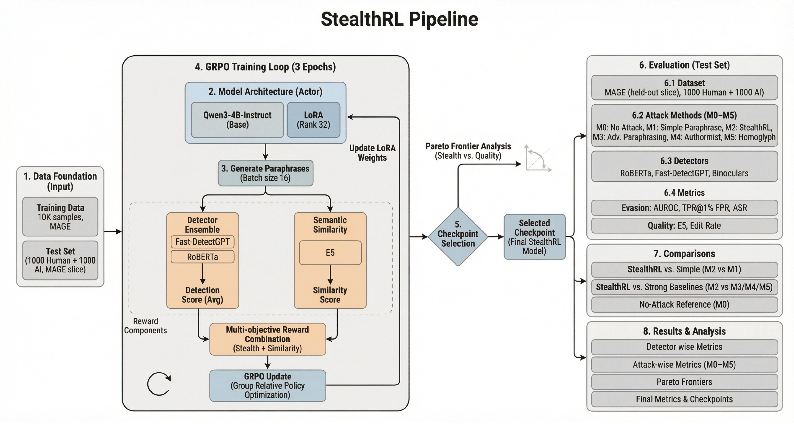

# StealthRL: Reinforcement Learning Paraphrase Attacks for Multi-Detector Evasion of AI-Text Detectors

**Abstract**  
AI-text detectors face a critical robustness challenge: adversarial paraphrasing attacks that preserve semantics while evading detection. *StealthRL* is a reinforcement learning framework for stress-testing detector robustness under realistic adversarial conditions. It trains a paraphrase policy against a multi-detector ensemble using Group Relative Policy Optimization (GRPO) with LoRA adapters on Qwen3-4B, optimizing a composite reward that balances detector evasion with semantic preservation. On the full filtered MAGE test pool (15,310 human / 14,656 AI) and a four-detector panel of RoBERTa, Fast-DetectGPT, Binoculars, and MAGE, StealthRL achieves near-zero detection on three of the four detectors and a 0.024 mean TPR@1%FPR, reducing mean AUROC from 0.79 to 0.43 while attaining a 97.6% attack success rate. The attack also transfers to held-out detectors not seen during training, revealing shared architectural vulnerabilities rather than detector-specific brittleness. This repository contains the training code, evaluation pipeline, and paper sources used for those experiments.



**Paper Sources**
- `acl2026/`: anonymized ACL 2026 SRW review package
- `arxiv/`: arXiv submission package and clean upload bundle

**Implementation Overview**
The rest of the implementation is organized as a modular, configuration-driven research codebase:
- `stealthrl/`: Core library (training, rewards, detectors, evaluation, data utilities)
- `eval/`: Standalone evaluation harness and reporting utilities
- `configs/`: YAML configurations for training, evaluation, and ablations
- `scripts/`: Entry points for training, evaluation, and visualization
- `analysis/`: Exploratory analysis helpers
- `tests/`: Sanity checks and integration tests
- `models/`: Optional baseline model adapters
- `checkpoints/`: Pointers to trained checkpoints (not included)

**Setup**
- Create a virtual environment and install dependencies:
  ```bash
  python -m venv venv
  source venv/bin/activate
  pip install -r requirements.txt
  ```
- Optional environment variables:
  - `HF_HOME` / `TRANSFORMERS_CACHE` for model cache location
  - `OPENAI_API_KEY` only if enabling GPT-based quality evaluation

**Quick Start**
- Train a small StealthRL run:
  ```bash
  python scripts/train_stealthrl.py --config configs/stealthrl_small.yaml
  ```
- Run evaluation:
  ```bash
  python scripts/run_stealthbench.py --config configs/stealthbench.yaml
  ```

**Reproducibility**
- All experiments are driven by YAML configs under `configs/` and logged to `outputs/`.

**Responsible Use**
This repository is intended for research and evaluation of AI-text detectors. It is not intended to facilitate academic dishonesty or evasion of legitimate safeguards.

**License**
MIT License. See `LICENSE`.
